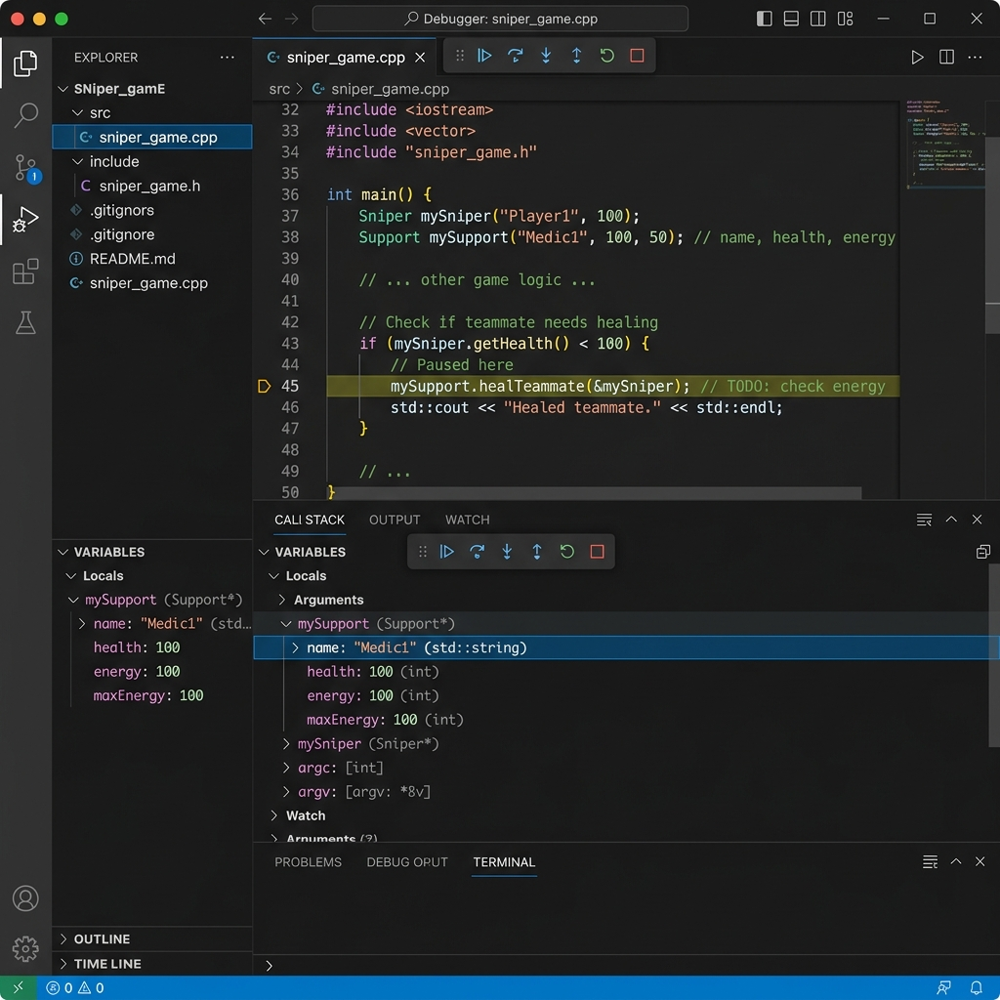
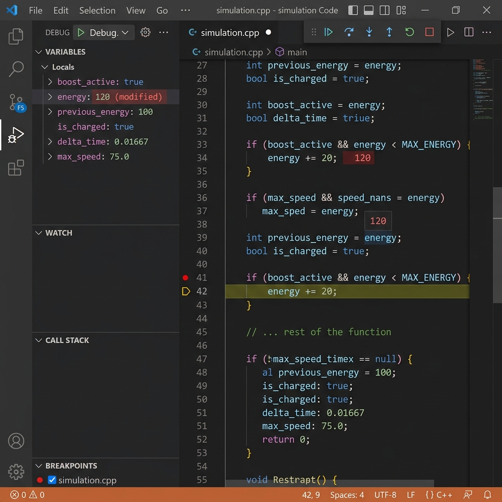

<div align="center">

# Debugging Report
### **E-Sports Tournament Manager**

<br>

| **Name** | **Project Title** | **Language** | **Debugging Tool** |
| :---: | :---: | :---: | :---: |
| Henil Patel | E-Sports Tournament Manager | C++ | Visual Studio Debugger |

</div>

<br>

---

## 1. Bug Description
> [!IMPORTANT]
> **Issue:** In the `Support` class, the `healTeammate(Player* teammate)` function restores the health of a teammate at the cost of the Support player's energy. However, an intentionally introduced bug causes the Support player to **gain** energy instead of **losing** energy when they perform a heal.

---

## 2. Expected Result
When `mySupport.healTeammate(&mySniper);` is called, it should cost **20 energy**. 

Since the Support player starts with 100 energy, the expected result is that their energy should decrease to `80`.
```math
100 \text{ (Initial Energy)} - 20 \text{ (Cost)} = 80 \text{ (Final Energy)}
```

---

## 3. Actual Result
> [!WARNING]
> **Infinite Energy Exploit!** When the function is called, the output shows that the Support player's energy increases to `120` instead of decreasing. This allows the Support player to have infinite energy and heal endlessly.

---

## 4. Root Cause
The root cause is a **logic error** involving an incorrect arithmetic operator in the `healTeammate` function. 

On **line 78** in `main.cpp`, the code is incorrectly written as:

```cpp
// INCORRECT (Adds energy instead of subtracting)
energy += 20; 
```

Instead of subtracting the energy cost, the `+=` operator adds it.

---

## 5. Debugging Steps

Follow these steps in an IDE (like Visual Studio, VS Code, or Code::Blocks) to debug the code and capture the required screenshots:

### Step 1: Set a Breakpoint
Open `main.cpp`. Scroll down to the `main()` function and place a breakpoint on **Line 105**:
```cpp
mySupport.healTeammate(&mySniper);
```

### Step 2: Start Debugging
Run the program in Debug mode (e.g., `F5` in Visual Studio). The execution will pause at your breakpoint before the heal happens.

### Step 3: Inspect Initial Variables
Look at the **Locals** or **Watch** window in your debugger. Expand the `mySupport` object and note that `energy` is exactly `100`.

> **Screenshot 1: Breakpoint & Initial State**
> Showing the debugger paused at the breakpoint and the initial energy value of 100.
> 
> 

### Step 4: Step Into the Function
Use **Step Into** (e.g., `F11`) to jump inside the `healTeammate` function. Step over the code until you reach line 78: `energy += 20;`.

### Step 5: Inspect the Bug Execution
Execute that single line (**Step Over** / `F10`). Look at the `energy` variable in the debugger window again. It will change from `100` to `120` (often highlighted in red by debuggers to indicate a changed value).

> **Screenshot 2: Stepping into the function & Bug execution**
> Showing the execution inside the function, with the energy variable now incorrectly changed to 120.
> 
> 

---

## 6. Final Fix
To resolve the bug, navigate to line 78 in `main.cpp` and change the addition assignment operator (`+=`) back to a subtraction assignment operator (`-=`).

| Before (Bugged Code) | After (Fixed Code) |
| :--- | :--- |
| ```cpp<br>energy += 20;<br>``` | ```cpp<br>energy -= 20;<br>``` |

> [!TIP]
> **Resolution:** After making this change, recompiling, and running the program, the Support player's energy now correctly decreases from **100** to **80** after healing a teammate.
